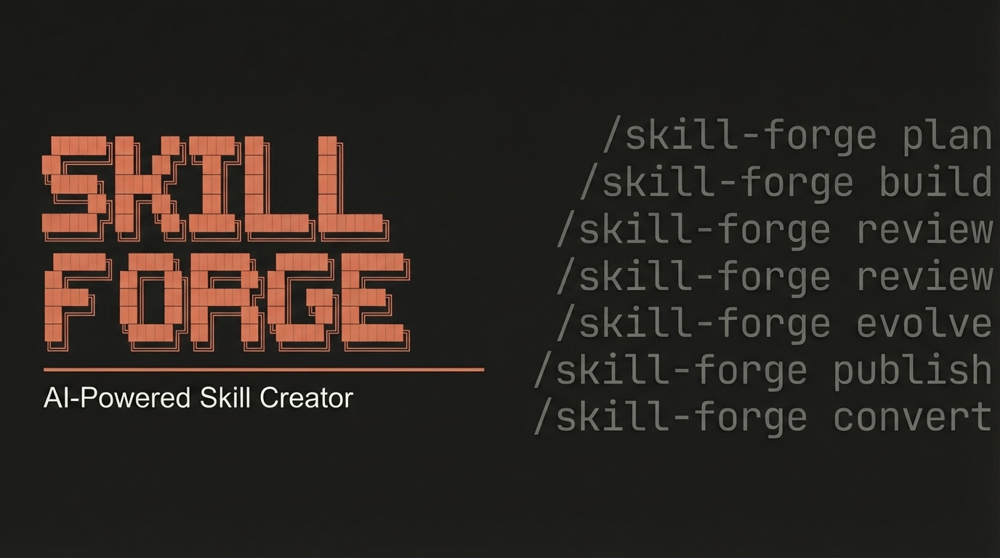

# Skill Forge — Ultimate Claude Code Skill Creator



Design, scaffold, build, review, evolve, and publish production-grade Claude Code skills following the [Agent Skills open standard](https://agentskills.io).

## Features

- **Plan** — Analyze use cases, select complexity tier (1-4), design architecture with sub-skill decomposition
- **Build** — Scaffold complete skill file trees with SKILL.md, sub-skills, scripts, references, and agents
- **Review** — Audit any skill with a 0-100 health score across 6 quality categories
- **Evolve** — Fix triggering issues, improve instructions, refine architecture based on feedback
- **Publish** — Package as `.skill` files, generate install scripts, prepare for GitHub distribution
- **Convert** — Port skills to OpenAI Codex, Google Gemini CLI, Google Antigravity, and Cursor

## Installation

### Unix / macOS / WSL

```bash
git clone https://github.com/AgriciDaniel/skill-forge.git
cd skill-forge
bash install.sh
```

### Uninstall

```bash
bash install.sh --uninstall
```

## Usage

### Commands

| Command | Description |
|---------|-------------|
| `/skill-forge` | Interactive skill creation wizard |
| `/skill-forge plan <domain>` | Architecture and design planning |
| `/skill-forge build <name>` | Scaffold and build a skill |
| `/skill-forge review <path>` | Audit an existing skill (0-100 score) |
| `/skill-forge evolve <path>` | Improve a skill from feedback |
| `/skill-forge publish <path>` | Package for distribution |
| `/skill-forge convert <path>` | Convert to Codex, Gemini, Antigravity, or Cursor |

### Examples

Create a simple skill:

```
/skill-forge build my-tool
```

Design a complex skill ecosystem:

```
/skill-forge plan "DevOps toolkit for Docker and Kubernetes management"
```

Review an existing skill:

```
/skill-forge review ~/.claude/skills/my-skill
```

Convert a skill for other platforms:

```
/skill-forge convert ~/.claude/skills/my-skill
```

Quick scaffold with the CLI script:

```bash
python skill-forge/scripts/init_skill.py devops-toolkit --tier 3 --sub docker,k8s,monitor
```

## Skill Complexity Tiers

| Tier | Name | Structure | Best For |
|------|------|-----------|----------|
| 1 | Minimal | Single SKILL.md | Simple workflows, document generation |
| 2 | Workflow | SKILL.md + scripts | Tasks needing deterministic validation |
| 3 | Multi-Skill | Orchestrator + sub-skills | Complex domains with multiple workflows |
| 4 | Ecosystem | Full system with agents | Enterprise-grade parallel analysis |

## Architecture

```
skill-forge/                       # Main orchestrator (Tier 4)
  SKILL.md                         # Entry point and routing
  references/                      # On-demand knowledge (10 files)
  scripts/                         # Execution scripts (4 files)
  assets/templates/                # Skill templates (4 tiers)
skills/
  skill-forge-plan/                # Architecture planning
  skill-forge-build/               # Scaffolding and generation
  skill-forge-review/              # Quality auditing
  skill-forge-evolve/              # Improvement and iteration
  skill-forge-publish/             # Distribution and packaging
  skill-forge-convert/             # Multi-platform conversion
agents/
  skill-forge-architect.md         # Architecture design agent
  skill-forge-writer.md            # Content writing agent
  skill-forge-validator.md         # Validation agent
  skill-forge-converter.md         # Platform conversion agent
```

## Dependencies

- **Python 3.10+** — Required for scaffolding, validation, packaging, and conversion scripts
- **Claude Code** — The CLI tool these skills are built for
- No external Python packages required (stdlib only)

## Built With

- [Agent Skills Standard](https://agentskills.io) — Open standard for AI agent skills
- [3-Layer Architecture](skill-forge/references/pro-agent.md) — Directive + Orchestration + Execution
- Inspired by [claude-seo](https://github.com/AgriciDaniel/claude-seo) and [Anthropic Skills](https://github.com/anthropics/skills)

## Support

- **Issues**: [GitHub Issues](https://github.com/AgriciDaniel/skill-forge/issues)
- **Discussions**: [GitHub Discussions](https://github.com/AgriciDaniel/skill-forge/discussions)

## License

[MIT](LICENSE)
